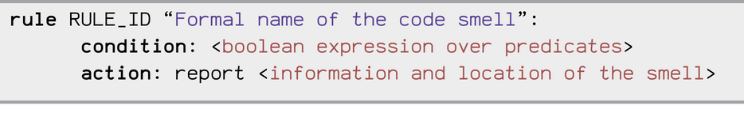

# Spec4AI CLI

This command-line interface (CLI) allows you to run Spec4AI's static code analysis rules on any Python project directory.

##  Usage

```bash
python spec4ai.py --input-dir <path> [--output-file <file>] [--rules R2 R6] [--all] [--exclude R6] [--summary] [--list-rules]
```

##  Examples

### Analyze a folder using all rules
```bash
python spec4ai.py --input-dir ./my_project --all
```

### Analyze with specific rules only
```bash
python spec4ai.py --input-dir ./my_project --rules R2 R6 R11
```

### Analyze all rules except some
```bash
python spec4ai.py --input-dir ./my_project --all --exclude R6 R11
```

### Save results to a custom file
```bash
python spec4ai.py --input-dir ./my_project --all --output-file results.json
```

### List all available rules
```bash
python spec4ai.py --list-rules
```

### Show a summary of alerts by rule
```bash
python spec4ai.py --input-dir ./my_project --all --summary
```

### Run all tests
```bash
./run_all_tests.sh
```

##  Output
- A JSON file containing detected issues, grouped by file and rule
- CLI printout showing:
  - Number of `.py` files scanned
  - Number of files with alerts
  - (Optional) Summary of alerts per rule

##  Project Structure Assumptions
- Rules are located in subfolders of `test_rules/` (e.g. `test_rules/R2/generated_rules_R2.py`)
- Each rule module must define a function named `rule_<ID>` and a global `report()` function used for collecting messages.



##  Requirements
- Python 3.9+
- Lark 1.2.2
- python -m pip install -r requirements.txt
- The `test_rules/` directory must exist and contain valid rule implementations
### Example : 

- python -m venv .venv
- source .venv/bin/activate  # or .venv\\Scripts\\activate sur Windows
- python -m pip install -r requirements.txt


##  Notes
- The CLI supports aliasing (e.g., `R11bis` counts as `R11`)
- The number of analyzed files includes all `.py` files recursively found under `--input-dir`

from pathlib import Path


##  Available Rules

Spec4AI supports detection of 24 AI-specific code smells, grouped by ML concern:

| Rule ID | Name                                                                                   |
|---------|-----------------------------------------------------------------------------------------|
| R1      | Broadcasting Feature Not Used                                                          |
| R2      | Random Seed Not Set                                                                    |
| R3      | TensorArray Not Used                                                                   |
| R4      | Training / Evaluation Mode Improper Toggling                                           |
| R5      | Hyperparameter Not Explicitly Set                                                      |
| R6      | Deterministic Algorithm Option Not Used                                                |
| R7      | Missing the Mask of Invalid Value (e.g., in `tf.log`)                                  |
| R8      | PyTorch Call Method Misused                                                            |
| R9      | Gradients Not Cleared before Backward Propagation                                      |
| R10     | Memory Not Freed                                                                        |
| R11     | Data Leakage (fit_transform before split)                                              |
| R11bis  | Data Leakage (no pipeline in presence of model.fit)                                   |
| R12     | Matrix Multiplication API Misused (np.dot vs np.matmul)                               |
| R13     | Empty Column Misinitialization                                                         |
| R14     | Dataframe Conversion API Misused (e.g., `.values`)                                     |
| R15     | Merge API Parameter Not Explicitly Set                                                 |
| R16     | API Misuse (e.g., missing inplace or reassignment)                                     |
| R17     | Unnecessary Iteration                                                                  |
| R18     | NaN Comparison (`== np.nan`)                                                            |
| R19     | Threshold Validation Metrics Count                                                     |
| R20     | Chain Indexing on DataFrames                                                           |
| R21     | Columns and DataType Not Explicitly Set in pd.read                                     |
| R22     | No Scaling Before Scale-Sensitive Operations                                           |
| R23     | EarlyStopping Not Used in Model.fit                                                    |
| R24     | Index Column Not Explicitly Set in DataFrame Read                                     |

---

##  Predicate Library

The DSL uses semantic predicates over AST nodes. Below is a list of predicates used across the rules:

### General AST Analysis
- `exists ... in AST: (...)`
- `count(...)`
- `not (...)`
- `and`, `or`, etc.

# Predicate Descriptions

## Model & Fit

- `isModelFitPresent(node)`  
  Returns True if the AST contains a `.fit()` call.

- `isFitCall(node)`  
  Returns True if the given node is a `.fit()` method call.

- `isMLMethodCall(node)`  
  Detects if the call is to a known ML model constructor (e.g., `RandomForestClassifier`).

- `hasEarlyStoppingCallback(node)`  
  Returns True if the `callbacks` argument of `.fit()` includes `EarlyStopping`.

- `hasExplicitHyperparameters(node)`  
  Returns True if the call explicitly sets at least one hyperparameter (via keyword arguments).

## Data Pipelines

- `pipelineUsed(node)`  
  Returns True if the given node is part of a pipeline call (e.g., `make_pipeline`, `Pipeline`).

- `pipelineUsedGlobally(node)`  
  Returns True if the entire AST contains a pipeline definition.

- `usedBeforeTrainTestSplit(node)`  
  Returns True if the given transformation is called before a `train_test_split`.

## Randomness / Determinism

- `isRandomCall(node)`  
  Detects usage of random functions across `random`, `numpy`, `torch`, or `tensorflow`.

- `seedSet(node)`  
  Returns True if the call sets a random seed (e.g., `np.random.seed`, `torch.manual_seed`).

- `isSklearnRandomAlgo(node)`  
  Detects usage of scikit-learn algorithms that rely on randomness.

- `hasRandomState(node)`  
  Checks if a call to a sklearn model includes the `random_state` parameter.

- `customCheckTorchDeterminism(ast_node)`  
  Returns True if torch is used and deterministic algorithms are not enabled.

## PyTorch / TensorFlow

- `isEvalCall(node)`  
  Returns True if the node calls `.eval()` on a model.

- `hasLaterTrainCall(node)`  
  Checks if there is a subsequent call to `.train()` or `optimizer.step()` after `.eval()`.

- `isForwardCall(node)`  
  Detects calls to `self.module.forward()` in PyTorch modules.

- `isLossBackward(node)`  
  Returns True if the node is a `.backward()` call.

- `hasPrecedingZeroGrad(node)`  
  Checks if `.zero_grad()` (or `clear_grad()` in Paddle) occurs before `.backward()`.

- `isPytorchTensorUsage(node)`  
  Detects operations on known PyTorch tensor variables (e.g., `.matmul()`).

- `isModelCreation(node)`  
  Detects creation of a known model object (e.g., `torch.nn.Linear(...)`).

- `isMemoryFreeCall(node)`  
  Returns True if memory release APIs like `.detach()` or `clear_session()` are used.

- `isLog(node)`  
  Returns True if the call is `tf.log(...)`.

- `hasMask(node)`  
  Returns True if the input to `tf.log` is wrapped in `tf.clip_by_value`, i.e., masked.

## DataFrame / Pandas

- `isDataFrameMerge(node)`  
  Returns True if the node is a call to `.merge()` on a pandas DataFrame.

- `singleParam(node)`  
  Returns True if the function call has only one argument or keyword.

- `isApiMethod(node)`  
  Detects calls to APIs that require reassignment or `inplace=True`.

- `hasInplaceTrue(node)`  
  Returns True if `inplace=True` is set.

- `isResultUsed(node)`  
  Returns True if the result of the call is used (assigned, returned, passed).

- `isPandasReadCall(node)`  
  Returns True if the node is a call to a pandas data loading function.

- `hasKeyword(node, kw)`  
  Checks whether a keyword argument with name `kw` is present.

- `isDataFrameVariable(var, node)`  
  Determines whether a variable is a pandas DataFrame within the node’s scope.

- `isSubscript(node)`  
  Returns True if the node is a subscript (e.g., `df[...]`).

- `get_base_name(node)`  
  Recursively extracts the base variable name of an expression.

- `usesIterrows(node)`  
  Detects use of the inefficient `.iterrows()` method.

- `usesItertuples(node)`  
  Detects use of `.itertuples()` (more efficient than `.iterrows()`).

- `isValuesAccess(node)`  
  Returns True if accessing `.values` of a DataFrame.

- `isDataFrameColumnAssignment(node)`  
  Detects assignments like `df["col"] = ...`.

- `isAssignedLiteral(node, value)`  
  Returns True if a literal value is assigned (e.g., `x = 0`).

## Numpy / Math

- `isCompare(node)`  
  Returns True if the node is a comparison (e.g., `a == b`).

- `hasNpNanComparator(node)`  
  Detects comparisons against `np.nan`.

- `isDotCall(node)`  
  Returns True if the node is a call to `np.dot()`.

- `isMatrix2D(node)`  
  Returns True if the function call takes two arguments (typically a 2D matrix op).

## Scaling / Metrics

- `isScaleSensitiveFit(node, vars)`  
  Returns True if `.fit()` is called on a model sensitive to data scaling.

- `hasPrecedingScaler(node, vars)`  
  Returns True if the data used in a `.fit()` call has been scaled.

- `isPartOfValidatedPipeline(node)`  
  Returns True if the operation is inside a pipeline with scaling + sensitive model.

- `isMetricCall(node)`  
  Returns True if the node is a metric function call.

- `isThresholdDependent(node)`  
  Returns True if the metric is threshold-dependent (e.g., precision, recall).

- `isThresholdIndependent(node)`  
  Returns True for metrics like `mean_squared_error` or `roc_auc_score`.

## Looping

- `isForLoop(node)`  
  Returns True if the node is a `for` loop.

- `isFunctionDef(node)`  
  Returns True if the node defines a function.

- `hasConstantAndConcatIntersection(node)`  
  Returns True if the block mixes `tf.constant()` and `tf.concat()`.

- `usesPythonLoopOnTensorFlow(node)`  
  Returns True if a native Python loop is used on a TensorFlow tensor.


## Add a Custom Detection Rule

### Integration Workflow
- New rules are added in subfolders of `test_rules/`, following the pattern `test_rules/RX/` where `X` is a rule number **not already used** (1–24 are reserved).
- Each rule must have:
  - A DSL file `test_RX.dsl` defining the rule logic
  - A test file `test_RX.py` for unit validation
  - (Optional for Scenario A) New predicate functions added to `parse.py`

### Scenarios
- **Scenario A**: Define a **new predicate**
  - Add its Python implementation in the `parse.py` header section (as a function taking an AST node and returning a boolean).
  - Use it in your DSL rule condition.

- **Scenario B**: Reuse **existing predicates**
  - Directly write the rule in `test_RX.dsl` using existing semantic predicates.

### Steps to Add a Rule
1. **Create a folder**
   ```bash
   mkdir test_rules/RX/

2. **Write the rule in DSLr**

- Create test_rules/RX/test_RX.dsl. Example:

  rule RX "Example rule":
      condition:
          exists node in AST: isExamplePredicate(node)
      action:
          report "Example issue detected"

3. ***(Scenario A) Add predicate definition***

- In parse.py, define a new predicate in the list "header". 


- header = [
    ...
  
        "def isExamplePredicate(node):",
          "...",
  ]

4. ***Create unit tests***
- Write test_rules/RX/test_RX.py:

5. ***Run tests***
- pytest test_rules/RX/test_RX.py

All tests must pass to validate the rule.


Developed as part of the Spec4AI project to support AI-specific code smell detection.
