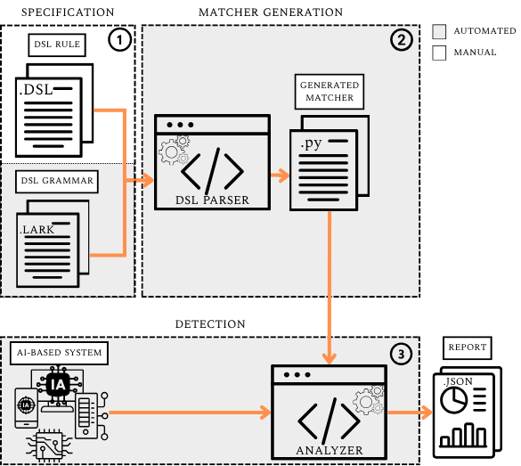

# Spec4AI CLI

This command-line interface (CLI) allows you to run Spec4AI's static code analysis rules on any Python project directory.

##  Usage

```bash
python spec4ai.py --input-dir <path> [--output-file <file>] [--rules R2 R6] [--all] [--exclude R6] [--summary] [--list-rules]
```

##  Examples

### Analyze a folder using all rules
```bash
python spec4ai.py --input-dir ./my_project --all
```

### Analyze with specific rules only
```bash
python spec4ai.py --input-dir ./my_project --rules R2 R6 R11
```

### Analyze all rules except some
```bash
python spec4ai.py --input-dir ./my_project --all --exclude R6 R11
```

### Save results to a custom file
```bash
python spec4ai.py --input-dir ./my_project --all --output-file results.json
```

### List all available rules
```bash
python spec4ai.py --list-rules
```

### Show a summary of alerts by rule
```bash
python spec4ai.py --input-dir ./my_project --all --summary
```

##  Output
- A JSON file containing detected issues, grouped by file and rule
- CLI printout showing:
  - Number of `.py` files scanned
  - Number of files with alerts
  - (Optional) Summary of alerts per rule

## 📁 Project Structure Assumptions
- Rules are located in subfolders of `test_rules/` (e.g. `test_rules/R2/generated_rules_R2.py`)
- Each rule module must define a function named `rule_<ID>` and a global `report()` function used for collecting messages.

##  Requirements
- Python 3.9+
- The `test_rules/` directory must exist and contain valid rule implementations

##  Notes
- The CLI supports aliasing (e.g., `R11bis` counts as `R11`)
- The number of analyzed files includes all `.py` files recursively found under `--input-dir`

---

Developed as part of the Spec4AI project to support AI-specific code smell detection.
